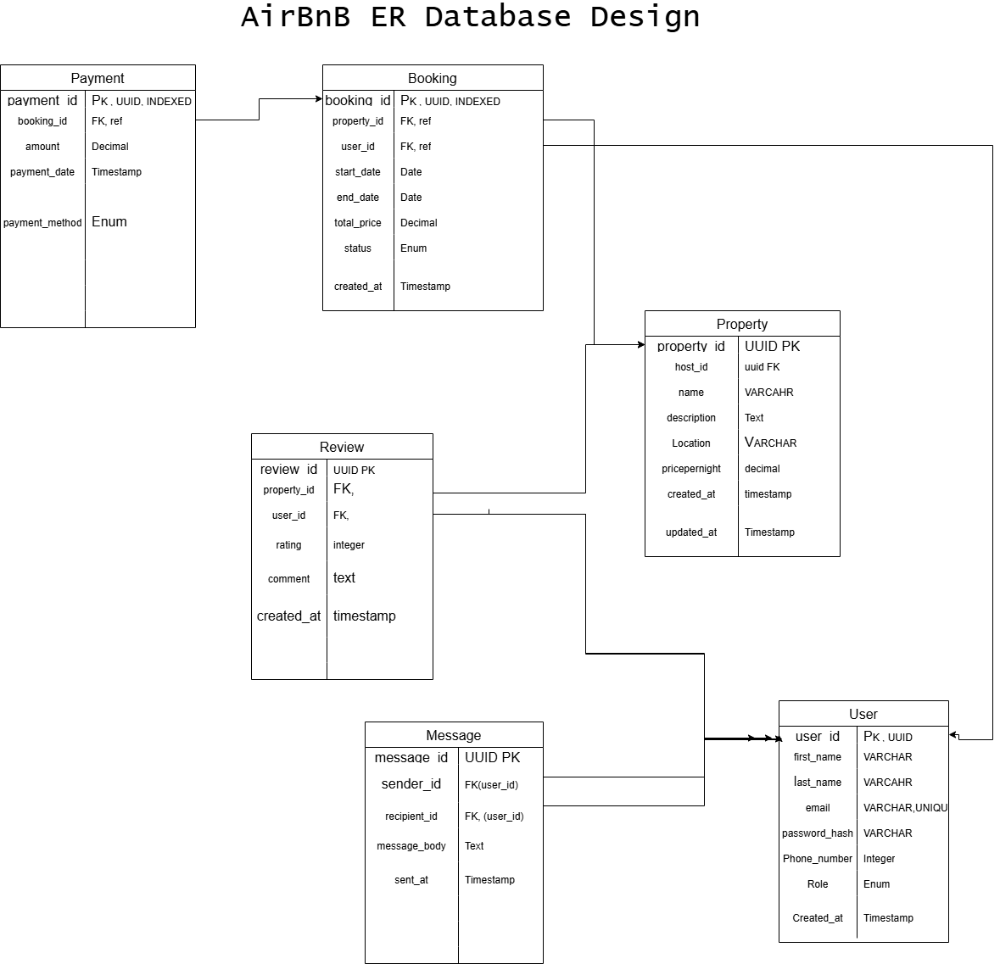

Normalization

The ER is already in the 3rd form of Normalization because,
1. The data is in the 1NF (Single column PK)
2. All non-keys depend on the whole primary keys
3. Eliminated all transitive dependencies
4. No redundancy on columns

Applied normalization principles to ensure the database is in the third normal form (3NF).

